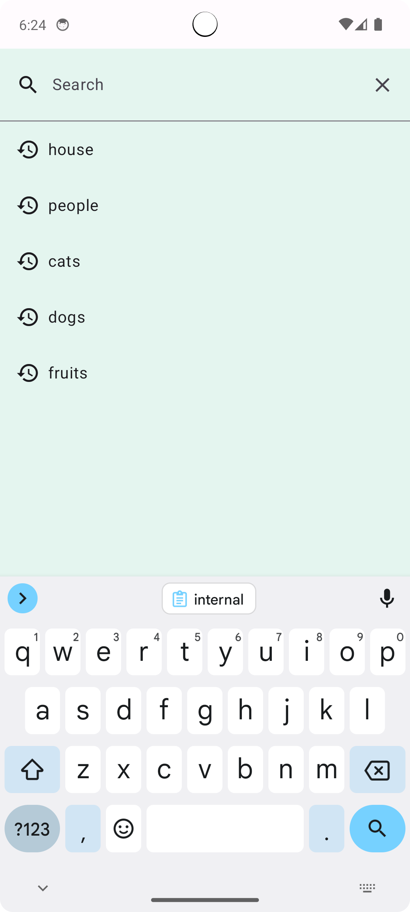
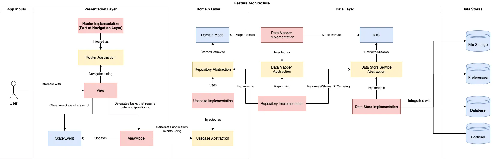

    

# Pixabay Image Searcher

 Simple android client that uses [**Pixabay API**](https://pixabay.com/api/docs/#api_search_images) to search images. 

## Features

  - Search images with search history (cashed)
  - Pagination 
  - Pull to refresh
  - Caching data and images (offline mode)
  - Automatic update after internet connection is restored
  - Dark/Light themes, fullscreen app design
  - Grid/List Feed view
  - Error, Empty, Loading view states
  - Parallax scrolling
  - Image cards (shadow, loading shimmer)
  - Show details alert dialog
  - Image Details screen with zoom
  - Show cached image at first on Image Details screen 
  - Share image url
  - Open user profile (web)

 ## Architecture

This app uses **Clean Architecture** with **MVVM** as [recommended app architecture](https://developer.android.com/jetpack/docs/guide#recommended-app-arch).

***Paging Architecture***

## Package Structure

The project follows a modular structure to maintain separation of concerns and organization.

- `app`: The main Android application module with Application and single Activity class.
- `core:common`: Containing common UI components, themes and utility classes.
- `core:domain`: The domain module holds business logic models, use cases and repository abstractions.
- `core:data`: The data module responsible for repository implementations and providing data from database and network modules.
- `core:database`: The module is responsible for storing data in a SQLite (Room) database.
- `core:network`: The network module responsible for the implementation of network requests and image caching.
- `feature:search`: Containing screens, views, navigation, and view models for image search feature.
- `feature:image`: Containing screens, views, navigation, and view models for image details feature.

## Technologies and Libraries Used

- [**Kotlin**](https://kotlinlang.org/) - The primary programming language for Android development.
- [**Jetpack Compose**](https://developer.android.com/jetpack/compose) - Used for building the user interface with a declarative and modern approach.
- [**Navigation Component**](https://developer.android.com/jetpack/compose/navigation) - Handles navigation between different screens and components.
- [**ViewModel**](https://developer.android.com/topic/libraries/architecture/viewmodel) - Stores UI-related data that isn't destroyed on UI changes.
- [**Flow**](https://kotlin.github.io/kotlinx.coroutines/kotlinx-coroutines-core/kotlinx.coroutines.flow/-flow/) - Flow in Kotlin, part of the Coroutines library, is a reactive data stream that supports asynchronous and sequential emission of values.
- [**Paging 3**](https://developer.android.com/topic/libraries/architecture/paging/v3-overview) - Allows you to perfom paging by loading small data chuncks at the time.
- [**Room**](https://developer.android.com/training/data-storage/room) - Provides offline access to feed data and handles local data storage.
- [**Retrofit**](https://square.github.io/retrofit/) - Used for making network requests to fetch feed data from a remote API.
- [**Coil-kt**](https://coil-kt.github.io/coil/) - An image loading and cashing library for Android backed by Kotlin Coroutines.
- [**Hilt**](https://developer.android.com/training/dependency-injection/hilt-android) - A dependency injection library for managing and injecting dependencies.

## Install

Clone the repository and in [local.defaults.properties](local.defaults.properties) file add your Pixabay API key which you can get by [registration](https://pixabay.com/accounts/register/).
(If your account has been approved for full API access you will be able to ge full size images.)
After you add the key, rebuild the projects so changes can have effect and simply run the app.

## License

